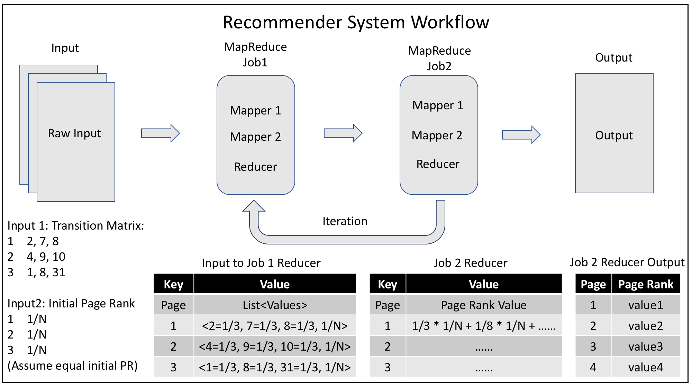
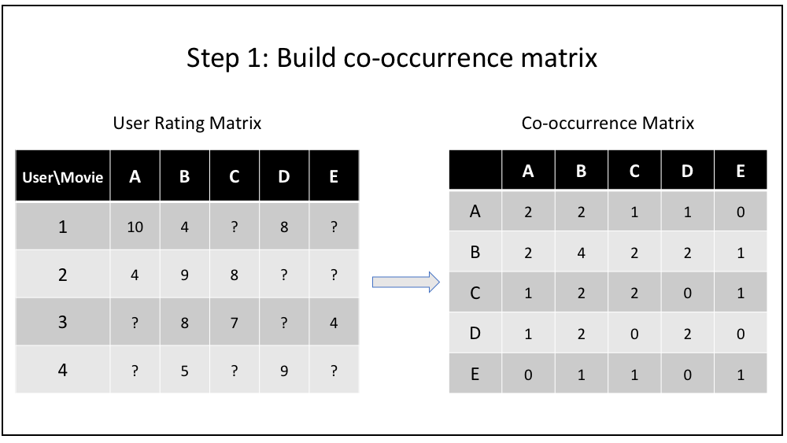
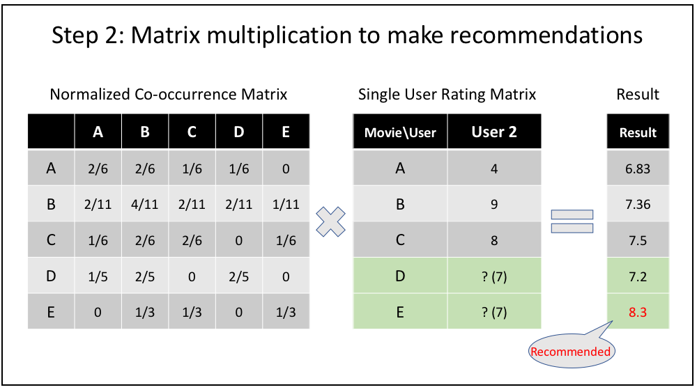

# Recommender-System
MapReduce Implementation of Movie Recommender System

Data source: [Netflix Prize Data Set][link1]

Original Input:

| User ID | Movie ID | Rating |
| ------- | -------- | ------ |
|    1    |    4     |  3.0   |
|    1    |   193    |  3.0   |
|    2    |   1920   |  3.0   |
|    3    |    3     |  3.0   |
|    3    |    10    |  3.0   |
|    4    |   1000   |  3.0   |
| ....... | ........ | ...... |

## Run code
    $: cd RecommenderSystem/
    $: hdfs dfs -mkdir /input
    $: hdfs dfs -put input/* /input
    $: cd src/main/java/
    $: hadoop com.sun.tools.javac.Main -d class/ *.java
    $: cd class/
    $: jar cf recommender.jar *.class
    $: hadoop jar recommender.jar Driver /input /dataDividedByUser /coOccurrenceMatrix /Normalize /averageRating /Multiplication /Sum
    $: hdfs dfs -cat /Sum/*

## Workflow

## Explanation
| MapReduce Jobs |             Goal and Functions                                       | File name                                         |
| -------------- | -------------------------------------------------------------------- | ------------------------------------------------- |
| 1 & 2          | Build the original co-occurrence matrix                              | DivideDataByUserID.java & CooccurrenceMatrix.java |
| 3              | Normalize the co-occurrence matrix                                   | Normalization.java                                |
| 4              | Calculate the user average rating                                    | AverageRating.java                                |
| 5 & 6          | Multiply co-occurrence matrix with rating matrix to make predictions | MatrixMultiplication.java & MatrixSum.java        |

+ MapReduce Job 1:
    - Mapper: read raw input information
        - input: userID, movieID, rating
        - output: < key=userID, value=movieID: rating >
    - Reducer: merge the output from Mapper according to unique userID
        - input: < key=userID, value=< movie1: rating1, movie2: rating2, ... > >
        - output: < key=userID, value="movie1: rating1, movie2: rating2, ..." >

+ MapReduce Job 2:
    - Mapper: read output from MapReduce job 1
        - input: userID \t "movie1: rating1, movie2: rating2, ..."
        - output: < key="movie_A: movie_B", value=1 >
    - Reducer: merge the output from Mapper according unique movieA: movieB
        - input: < key="movie_A: movie_B", value=1, 1, 1, ... >
        - output: < key="movie_A: movie_B", value=count >

+ MapReduce Job 3:
    - Mapper: read output from MapReduce job 1 and split
        - input: movie_A: movie_B \t count
        - output: < key=movie_A, value="movie_B=count" >
    - Reducer: calculate the normalized co-occurrence matrix value
        - input: < key=movie_A, value=< movie_B=count, movie_C=count, ... > >
        - output: < key=movie_B, value="movieA=count/total" >

+ MapReduce Job 4:
    - Mapper: read the original user rating information
        - input: userID, movieID, rating
        - output: < key=userID, value=rating >
    - Reducer: merge the output from Mapper according to unique userID
        - input: < key=userID, value=< rating1, rating2, ... > >
        - output: < key=userID, value=< average rating > >

+ MapReduce Job 5:
    - Mapper 1: read co-occurrence matrix from MapReduce Job 3
        - input: movie_B \t movie_A=ratio
        - output: < key=movie_B, value="movie_A=ratio" >
    - Mapper 2: read the original user rating information to build the rating matrix
        - input: userID, movieID, rating
        - output: < key=movie_B, value="userID: rating" >
    - Reducer:
        - input: < key=movie_B, value="movie_A=ratio1, movie_C=ratio2, ..., user1: rating1, user2: rating2, ..." >
        - output: < key="userID: movieID", value=ratio * rating >
        - setup: read the user average rating

+ MapReduce Job 6:
    - Mapper: read the output from MapReduce Job 4
        - input: userID: movieID \t ratio * rating
        - output: < key="userID: movieID", value=ratio * rating >
    - Reducer:
        - input: < key="userID: movieID", value=< subrating1, subrating2, ... > >
        - output:< key="userID: movieID", value=rating prediction >

[link1]: http://academictorrents.com/details/9b13183dc4d60676b773c9e2cd6de5e5542cee9a
